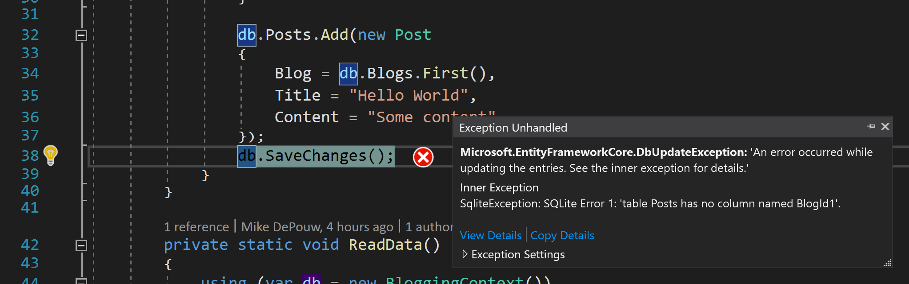
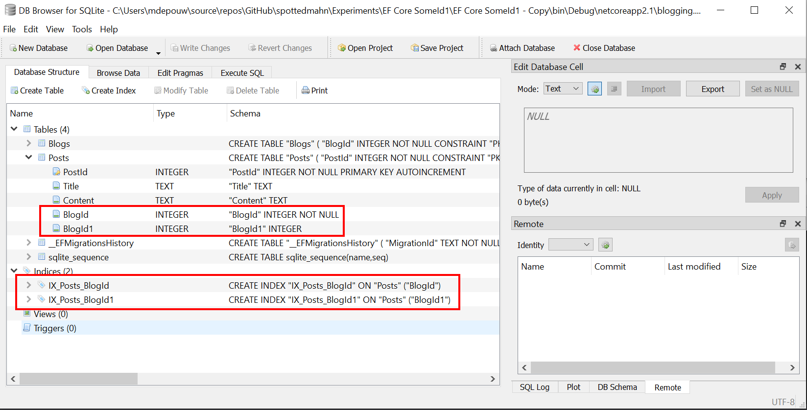

>SqliteException: SQLite Error 1: 'table Posts has no column named BlogId1'.

>INSERT INTO "Posts" ("BlogId", "BlogId1", "Content", "Title")  
VALUES (@p0, @p1, @p2, @p3);  
SELECT "PostId"  
FROM "Posts"  
WHERE changes() = 1 AND "PostId" = last_insert_rowid();  

